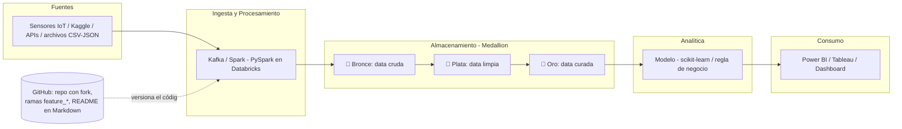

# 📋 Resumen — Clase de Big Data (Esp. Analítica de Datos, 1er semestre G2)

> Resumen de la grabación de la reunión en Teams. Incluye lo que te perdiste, fechas clave, el trabajo final, la metodología del curso y el paso a paso de GitHub + Databricks.

---

## 🗓️ Fechas y logística (¡lo más urgente!)

| Qué | Cuándo | Detalle |
|---|---|---|
| **Próxima clase** | **Mañana a las 8:00** | Workshop práctico: caso de riesgo de crédito leyendo datos desde Kaggle. Cada uno generará código con prompts (Genie). También se hará el *pull* para actualizar el repo. |
| Viaje del profesor | 15–18 de junio | Va al **Databricks Summit en San Francisco**. No hay clase viernes ni esa semana. Regresa el 19 en la noche. |
| Clase 3 | **Sábado 20 de junio** | Confirmó que sí hay clase ese día (hablará con la universidad por el cierre de semestre; avisa por Teams). |
| Clases 4 y 5 | **Lunes 22 y jueves 25 de junio** | Empiezan más tarde de lo normal: **~5:30–5:40 pm**. Se puede asistir virtual. |
| Sexta sesión | Se reemplaza | En vez de una 6ª clase, cada equipo tiene **3 asesorías de 45 minutos** (virtuales). Se piden por **WhatsApp o correo** al profesor y pueden empezar **desde ya**. |
| **Entrega del trabajo final** | **A más tardar el 29 de junio** | Fecha inamovible: el profesor pasa notas ese día porque cierra el semestre. |

---

## 📦 Trabajo final (sí hay entrega — vale la materia)

Se hace en **equipos de 2 personas (máximo 3)**. Los pasos y fechas están publicados en **Teams** junto con las 3 presentaciones del curso (en inglés). Componentes que debe tener:

1. **Caso de negocio** — puede ser real (de tu empresa) o con datos ficticios/simulados.
2. **Análisis beneficio–costo** — *cualitativo*, no cuantitativo: qué beneficio trae la solución vs. lo que cuesta (ej.: una IA de 300 USD/mes que reemplaza el trabajo de 3 funcionarios, ¿vale la pena?).
3. **Arquitectura propuesta** — diagrama de qué herramientas/frameworks vas a usar para captura, procesamiento, almacenamiento, modelado y visualización. *El profesor dijo que esta parte pesa ~10% del trabajo.*
4. **Pipeline de ingesta de datos** — automatización de cómo los datos viajan desde la fuente hasta el consumo (arquitectura *medallion*: bronce → plata → oro).
5. **Modelo / análisis** — el dato debe terminar siendo consumido por un modelo o regla de negocio.
6. **Visualizaciones** — Power BI, Tableau u otra herramienta vista en clase.
7. **Repositorio en GitHub** — todo documentado en Markdown (README con: caso de negocio, análisis económico, arquitectura, fuente de datos, cómo se ejecuta, qué hace el modelo). El profesor mostró ejemplos de estudiantes anteriores (predicción de partidos de Champions, scoring de cartera, dashboard de acueductos) y su propio repo de un robot que detecta fallas en alcantarillados con YOLO. La meta: *superar esos trabajos*.

> 💡 También insistió en que en Databricks, el **catálogo / linaje de datos (Unity Catalog)** es clave — lo describió como "el 50% de lo que tienen que hacer para ganar la materia". Tenlo presente al armar el pipeline.

---

## 🐙 Qué debes hacer en GitHub (paso a paso de la clase)

La clase fue muy práctica en esto. Si no estuviste, esto es lo que todos hicieron y tú debes replicar:

1. **Crear cuenta en GitHub** (github.com) — recomendado con **correo personal de Gmail** (entra directo, sin fricción). Sin eñes, tildes ni mayúsculas en nombres de usuario/repos.
2. **Hacer *fork* del repositorio del profesor** — el link es **https://github.com/yeiscop/Big_Data** (repo llamado `Big_Data`, con guion bajo). Fork ≠ clone: el fork te deja **dueño de tu propia copia** para siempre. Botón **Fork → Create new fork**.
3. **Crear cuenta en Databricks Free Edition** — en el link que compartió en Teams, con **correo personal** (no el institucional, salvo que tu empresa tenga convenio). No pide tarjeta de crédito.
4. **Clonar tu fork dentro de Databricks**: `New → More → Git folder` → pegar la URL de tu repo (botón verde **Code** en GitHub → copiar la URL HTTPS) → **Create Git folder**.
5. **Generar un Personal Access Token en GitHub**: tu foto de perfil → **Settings → Developer settings → Personal access tokens → Tokens (classic) → Generate new token (classic)** → ponle un nombre (ej. `clase`), expiración por defecto (30 días), y **marca todos los scopes** → generar y **copiar el token**.
6. **Linkear GitHub con Databricks**: en Databricks, tu inicial (arriba a la derecha) → **Settings → Linked accounts → Add Git credential → Personal access token** → pega tu correo de GitHub y el token → **Save**.
7. **Crear una rama (branch)**: en tu Git folder, clic en `main` → **Create branch** → nombre en minúsculas con guion bajo, ej. `feature_clase`. **Nunca trabajes directo sobre `main`** — trabajas en la rama y luego los cambios se aprueban/versionan (eso es Git: un gestor de versiones de código; GitHub es "el jefe" que autoriza los cambios de "la empresa", que es Databricks).
8. ⚠️ Regla de oro al programar: **nada de eñes, tildes, mayúsculas ni espacios** en nombres de archivos, ramas o variables.

> Nota: GitHub es para **código**, no para almacenar datos (el profe subió datos ahí solo por fines de clase).

---

## 🧠 Metodología del curso

- **6 sesiones**, pero quedan **5 clases efectivas** + **3 asesorías de 45 min por equipo** que reemplazan la sexta (para nivelar, porque hay perfiles muy diversos: administradores, politólogos, ingenieros, contadores, licenciados...).
- Modalidad **híbrida**: presencial + virtuales conectados por Teams. Las clases se graban.
- Material en **Teams**: 3 presentaciones (en inglés, porque la literatura de ciencia de datos está en inglés) + pasos y fechas del proyecto.
- Dinámica de cada clase: arranca con **noticias del sector** (Hugging Face, papers, Google I/O, Databricks Summit...), luego teoría corta y **mucha práctica guiada** en vivo.
- Evaluación: **no hay parciales** — todo gira alrededor del **proyecto final** (con porcentajes por componente para "sacar el 5").
- Herramienta principal: **Databricks Free Edition** (agnóstica a la nube, sin configurar servidores, sin tarjeta). Se complementa con vistazos a **AWS (S3, SageMaker), Azure (ADLS Gen2, Azure ML, AI Foundry) y GCP (BigQuery, GCS, Vertex AI)**.
- ⚠️ **No actives BigQuery/GCP con tu tarjeta**: puede generar cobros (el profesor contó que una vez dejó GPUs prendidas y le costó ~3 millones de pesos). Él hace esas demos con su propia cuenta.
- Recomendó registrarse (con correo personal) en **Databricks Academy** — tiene cursos y certificaciones gratis.

---

##  Contenido que te perdiste (resumen conceptual)

### 1. Qué es Big Data — las 5 V
**Volumen, Velocidad, Variedad, Valor y Veracidad.** Big Data aparece cuando la capacidad tradicional de procesamiento ya no alcanza: datos en tiempo real (sensores IoT), no estructurados (imágenes, audio, JSON, PDFs, grafos), y a gran escala. Al final del curso verán también *small data* (qué hacer cuando hay pocos datos).

### 2. Ecosistema de herramientas presentado
- **Visualización**: Power BI, Tableau, Qlik Sense, Dash, Gradio.
- **ML/Modelado**: scikit-learn, TensorFlow, PyTorch, MLflow.
- **Exploración**: pandas, NumPy, Matplotlib, Seaborn.
- **Bases de datos**: Cassandra, MongoDB, Neo4j.
- **Procesamiento masivo**: **Spark** ("el papá de todos") vía **PySpark**; ingesta con **Kafka**.
- **Storage**: AWS S3, Azure ADLS Gen2, Google Cloud Storage; **Kaggle** y **Hugging Face** como fuentes de datos y modelos.

### 3. Arquitectura *Medallion* (la verán a fondo)
Bronce = datos crudos sin tocar → Plata = datos limpios/depurados → Oro = datos curados listos para consumo. (Un compañero confirmó: equivale a capa cruda / depurada / procesada.)

### 4. Práctica 1 (en el repo, archivo *practice 1*, formato `.ipynb`)
Simularon sensores de presión de agua con **PySpark**: crear el DataFrame, filtrar presiones > 0, agrupar por sensor y promediar, y marcar riesgo si la presión < 35–40 PSI (regla determinística, sin modelo aún → a esos se les "manda la cuadrilla"). Diferencia visual: tablas de **Spark DataFrame** (`.show()`) vs. **pandas DataFrame** (`display()`).

### 5. Genie — el asistente de IA de Databricks
Al final hicieron un mini-ejercicio: crear un Notebook nuevo, abrir **Genie** y pedirle con un prompt: *"simular datos de medidores de energía con pandas en Python, transformar valores menores a cero y hacer un modelo de regresión para pronosticar futuras medidas"*. Genie genera todo el código (instala librerías, hace EDA, series de tiempo con tendencia/estacionalidad, train/test split). Mensaje del profe: *"ya no van a ser programadores, sino orquestadores de código"* (GitHub Copilot, Claude Code, Cursor, Gemini...). Todo se guarda solo (auto-save).

### 6. Tipos de modelos (mención introductoria, lo verán en Modelado)
- **Supervisados**: hay etiqueta histórica (ej. scoring de crédito, motos robadas, pérdida esperada/IFRS 9).
- **No supervisados**: sin etiquetas → clusterización.
- **Semisupervisados**: pocas etiquetas → detección de anomalías (fraude, ciberataques).
- Mencionó también aprendizaje por refuerzo y grafos como temas avanzados.

---

## 🏗️ Gráfico — Arquitectura del proyecto final

Este es el flujo que tu trabajo debe reflejar (basado en el ejemplo de fugas de agua mostrado en clase):

## ✅ Tu checklist inmediato

- [ ] Crear cuenta en **GitHub** (correo personal) y hacer **fork** del repo `Big_Data` del profesor (link: https://github.com/yeiscop/Big_Data).
- [ ] Crear cuenta en **Databricks Free Edition** (correo personal) y **clonar tu fork** como Git folder.
- [ ] Generar **token clásico** en GitHub y **linkearlo** en Databricks (Settings → Linked accounts).
- [ ] Crear tu rama `feature_clase` (minúsculas, guion bajo).
- [ ] Descargar las **presentaciones de Teams** (van por la diapositiva ~25–27).
- [ ] **Definir tu equipo** (2, máx. 3 personas) y empezar a pensar el **caso de negocio**.
- [ ] **Agendar las asesorías** por WhatsApp/correo con el profesor (3 × 45 min, desde ya).
- [ ] Asistir **mañana a las 8:00** (workshop de riesgo de crédito con Kaggle) y anotar: 20, 22 y 25 de junio.
- [ ] **Entregar el trabajo final antes del 29 de junio.**

---

## 📄 Documentos de referencia complementarios

En la carpeta `Documentos/` encontrarás material adicional que complementa lo visto en clase:

| Documento | Tema Principal | Relevancia para el curso |
|---|---|---|
| **Big_Data_UNAULA_First_Module.pdf** | Fundamentos de Big Data - Módulo 1 UNAULA | Base teórica del curso, cubre conceptos fundamentales |
| **AI_Native_Data_Blueprint.pdf** | Arquitectura de datos nativa para IA | Diseño de pipelines optimizados para modelos de IA |
| **Modern_Data_Refinery.pdf** | Refinería de datos moderna | Procesos de transformación y limpieza de datos a escala |
| **Big_Data_to_AgentOps.pdf** | Evolución de Big Data a operaciones con agentes | Tendencias futuras y automatización con agentes de IA |
| **PROYECTO_FINAL.pdf** | Especificaciones detalladas del proyecto final | Requisitos completos, criterios de evaluación y entrega |

> 💡 Estos documentos contienen información detallada sobre arquitecturas, mejores prácticas y especificaciones del proyecto final. Se recomienda revisarlos especialmente para la sección de arquitectura propuesta y el pipeline de datos del trabajo final.
