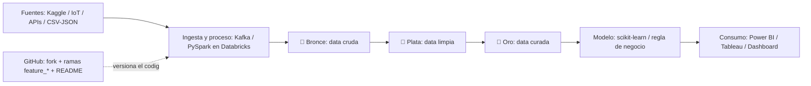

# 📋 Clase 2 — Profundización: nube, Medallion y modelado (06 de junio de 2026)

> Segunda clase (Teams). Profundiza en plataformas de nube, la arquitectura Medallion con Unity Catalog, la diferencia Spark/pandas, y un ejercicio de modelado con Genie. Asume el setup de GitHub/Databricks ya hecho en la Clase 1.

---

## 🧭 Lo esencial de esta clase
- **Noticias del sector** y por qué el repo es tu "hoja de vida".
- **Plataformas de nube** (AWS / Azure / GCP) en detalle.
- **Medallion + Unity Catalog** a fondo.
- **Spark DataFrame vs pandas** y nociones de **series de tiempo / EDA**.
- **Ejercicio con Genie**: medidores de energía + regresión.
- **Tipos de modelos** (intro).

---

## 1. Noticias del sector
Hugging Face (modelos libres), Google I/O, papers recientes y el **Databricks Summit** (15–18 jun, San Francisco).

## 2. Perfiles del grupo y el repo como hoja de vida
Grupo diverso (administradores, ingenieros, contadores, politólogos, licenciados…). El profe insistió: **el repositorio es tu hoja de vida** como analista, y las empresas serias mantienen repos para no perder el código cuando alguien se va.

## 3. Plataformas de nube
- **AWS**: muy madura — **S3** (storage de cualquier dato), **SageMaker** (ML).
- **Azure**: **ADLS Gen2** (storage), **Azure ML**, **AI Foundry**.
- **GCP**: **BigQuery** (SQL a gran escala), **GCS**, **GCE**, **Vertex AI**; usa TPUs.

> ⚠️ No actives BigQuery/GCP con tu tarjeta: el profe contó que dejó GPUs prendidas y le costó ~3 millones de pesos.

## 4. Arquitectura Medallion + Unity Catalog (a fondo)
Unity Catalog permite los 3 niveles:
- **Bronce**: data bruta/cruda, sin transformar.
- **Plata**: data limpia y depurada.
- **Oro**: data curada, lista para consumo.
Ejemplo de sensores de agua: crudo → condiciones de limpieza → consumo. El **linaje de datos** es clave (≈ 50% de la nota).

## 5. Spark DataFrame vs pandas
- **Spark/PySpark**: procesamiento masivo ("el papá de todos"); solo entiende Linux (en Windows on-premise es difícil).
- En la práctica: `.show()` (Spark) vs `display()` (pandas).

## 6. EDA y series de tiempo
- Siempre hacer **EDA** antes de modelar (estadística descriptiva, gráficos, detección de anomalías/negativos).
- Series de tiempo: estacionalidad, autoregresión, tendencia, estacionariedad, media móvil → familia **SARIMAX**.

---

## 💻 Práctica 1 (repaso) — Sensores de presión de agua (PySpark)
DataFrame simulado → filtrar presión > 0 → agrupar y promediar por sensor → marcar riesgo si < 35–40 PSI.

## 🧠 Ejercicio con Genie — Medidores de energía
**Prompt**: *"simular datos de medidores de energía con pandas en Python, transformar valores menores a cero y hacer un modelo de regresión para pronosticar futuras medidas."*
Genie generó automáticamente:
- Instalación de librerías (pandas, numpy, matplotlib, seaborn).
- Datos simulados (consumo base ~50 kW, tendencia +0.01/h, componente estacional).
- Transformación de valores negativos.
- **EDA** (descriptivas, consumo vs temperatura, correlogramas, estacionalidad).
- **Train/test split** + modelo de regresión.

Concepto: te vuelves un **"orquestador de código"** (Genie, Copilot, Claude Code, Cursor, Gemini) en vez de programar línea a línea.

## 🤖 Tipos de modelos (introducción)
- **Supervisados**: con etiqueta histórica (scoring de crédito, IFRS 9 / pérdida esperada).
- **No supervisados**: sin etiquetas → clusterización.
- **Semisupervisados**: pocas etiquetas → detección de anomalías (fraude, ciberataques).
- Mención: aprendizaje por refuerzo y grafos (avanzado).

---

## 🏗️ Arquitectura objetivo del proyecto

---

## 📋 Asignaciones tras la Clase 2
- [ ] **Definir el caso de negocio** del proyecto final.
- [ ] **Agendar asesorías** (3 × 45 min) por WhatsApp/correo.
- [ ] Seguir trabajando el repo (ramas `feature_*`).
- [ ] Prepararse para la **Clase 3 (sáb 20 jun)**: workshop de **riesgo de crédito** con dataset de Kaggle.

## ⚠️ Recordatorios
- Nunca subas tokens/credenciales.
- Nada de eñes, tildes, mayúsculas ni espacios.
- Nunca trabajes sobre `main`.
- GitHub = código, no datos.

---

*Resumen generado a partir de la transcripción de la clase del 06 de junio de 2026.*
